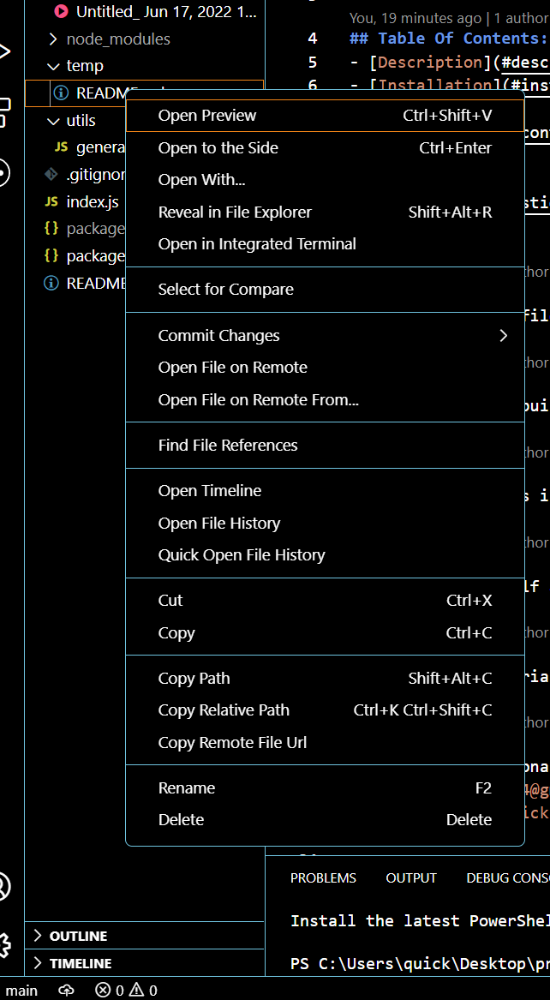

# **Professional *README* Generator**

##### [Github repo source](https://github.com/quicksilver524/Professional-README-Generator)

## Description:

######  This is a *README* generator built to aid with production of a *README* file within your developed projects that will track and upload from the terminal to the *README* file. The goal of this is to improve communication and to aid with redundancy within a project in order to build professional *README* that can be utilized for navigation within a project and or functional collected data produced by the user. 

## Walkthrough Video:

https://user-images.githubusercontent.com/102430476/174318637-07429148-ebab-4179-b547-fbe894295982.mp4

# Open New terminal within VS code or cmdline: 

# Type "node index.js within VS code or cmdline: 

# Answer questions within VS code or cmdline to produce *README*: 

# Click "preview" within VS code: 

# View *README* within preview to see outcome and navigate links: 

